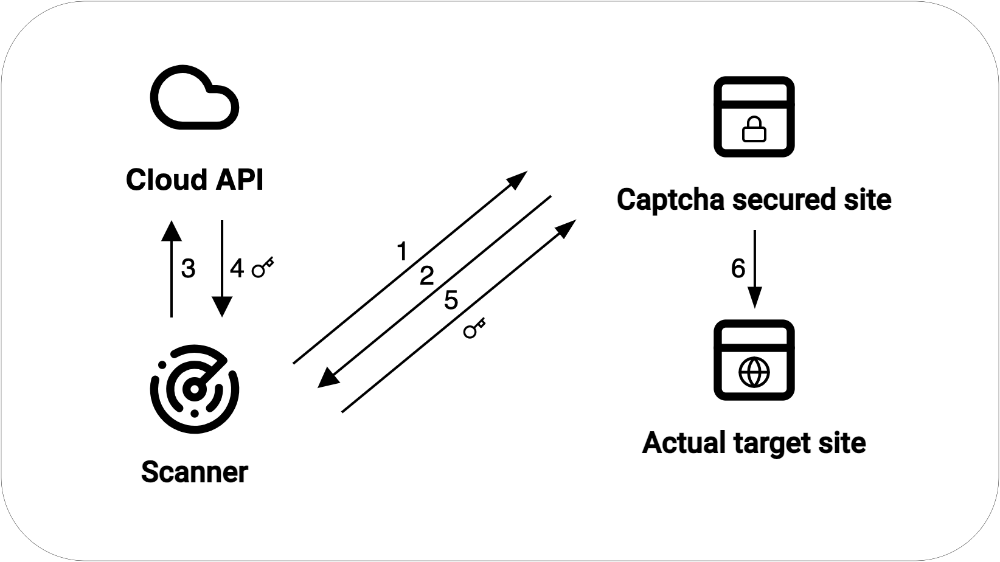

import Image from 'next/image'
import Link from 'next/link'
import {
  Carousel,
  CarouselContent,
  CarouselItem,
  CarouselNext,
  CarouselPrevious,
} from "../../../components/ui/carousel"

# Scanner Cloud API

Scanner Cloud API allows you to integrate the Scanner with a powerful API that helps you achieve good scan results. 

Currently, the Scanner Cloud API has limited features and is in beta. We are working on adding more features to the API. We welcome your feedback and suggestions.

## Features

- **Captcha Solving**: The Scanner Cloud API can solve Captchas for you on phishing sites that try to prevent scannning by requiring victims to solve captchas such as Google's Recaptcha or hCaptcha. This is useful when the Scanner encounters a Captcha while scanning a website. The Scanner Cloud API can solve the Captcha and send the solution back to the Scanner.

### Supported Captchas

Currently, the Scanner Cloud API supports the following Captchas:

| Captcha | Support |
|---------|-----------|
| Google Recaptcha v2 | Yes |
| hCaptcha | Yes |
| Google Recaptcha v3 | Planned |
| Cloudflare Challenge | Planned |
| reCAPTCHA v2 Enterprise | No |
| reCAPTCHA v3 Enterprise | No |

There is no planned support for Enterprise versions, since they require more vetting by the Captcha providers and are not commonly used on phishing sites.

## How to use Scanner Cloud API

1. Sign in to [Webhood Cloud](https://cloud.webhood.io).
2. Create a new API token in Scanner API section.
3. Go to your Webhood Console and configure the Scanner to use the Scanner Cloud API.

### Example

<Carousel 
  opts={{
    align: "center",
  }}>
  <CarouselContent>
    <CarouselItem>
        <Image priority src="/cloudapi-tutorial/1.jpg" width={2048/2} height={1536/2}/>
    </CarouselItem>
    <CarouselItem>
        <Image priority src="/cloudapi-tutorial/2.jpg" width={2048/2} height={1536/2}/>
    </CarouselItem>
    <CarouselItem>
        <Image priority src="/cloudapi-tutorial/3.jpg" width={2048/2} height={1536/2}/>
    </CarouselItem>
  </CarouselContent>
  <CarouselPrevious />
  <CarouselNext />
</Carousel>

## Details

The following diagram shows how the Scanner Cloud API works together with the Scanner:

(0. You send a request to the Scanner to start a scan via Console or API)
1. The scanner browses the website and collects the website data.
2. The scanner notices a Captcha on the website.
3. The scanner sends metadata about the Captcha to the Scanner Cloud API.
4. The Scanner Cloud API attempts to solve the Captcha and sends the solution back to the Scanner.
5. The scanner inputs the Captcha solution on the site 
6. Usually, the page then redirects to actual site that we want to scan.
