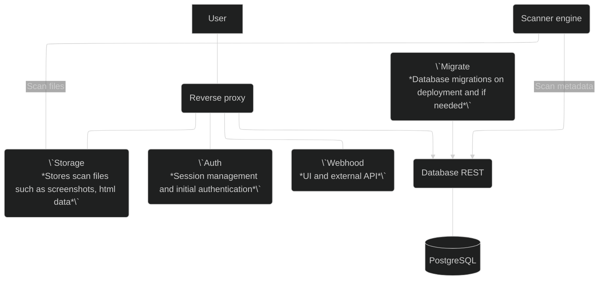

# Security

## Architecture

The following diagram shows the architecture of the application. The diagram shows the components as they are deployed in containers using the docker-compose file.:

It is notable, that some components handle authentication / authorization themselves while some rely on the reverse proxy to do so. The reverse proxy is thus vital for the security of the application.

## Security considerations

## Security checklist ✓

Before you consider your deployment to be production-ready, you should have completed the following checklist:

### Mandatory

The following items are mandatory for production readiness. You must not omit any of these items.:

    * [ ] Secure environment variables are used for all sensitive variables, including database credentials, API keys, and secrets.
    * [ ] Users are able to access the application only via HTTPS.

### Recommended

The following items are recommended. You may choose not implement these after considering the trade offs in your environment.

    * [ ] The application is deployed to a private network with connectivity from your internal users only.
    * [ ] You are running the application in a dedicated host or VM.
    * [ ] You have set up a production-grade TLS certificate for the application signed by trusted CA.

## Risks

The following table lists notable risks that are associated with the application. The table also lists the recommended mitigation actions to lower the likelihood and/or impact of the risk as well as response actions in case the risk is realized.

| Risk                                                                                                                                                                                                                                | Mitigation                                                                                                                                                                                                                                                                        | Response                                                                                                                                                                                                                                                                                                                                    |
| ----------------------------------------------------------------------------------------------------------------------------------------------------------------------------------------------------------------------------------- | --------------------------------------------------------------------------------------------------------------------------------------------------------------------------------------------------------------------------------------------------------------------------------- | ------------------------------------------------------------------------------------------------------------------------------------------------------------------------------------------------------------------------------------------------------------------------------------------------------------------------------------------- |
| JWT secret is exposed or stolen                                                                                                                                                                                                     | Store the secret securely. Never store these secrets in version control etc.                                                                                                                                                                                                      | Rotate the secret. You can rotate the JWT secret simply by changing it. All previously created user sessions and tokens will cease to function.                                                                                                                                                                                             |
| User credentials are exposed or stolen                                                                                                                                                                                              | Practice modern best-practices for educating users about safe password use                                                                                                                                                                                                        | Change the user's password.                                                                                                                                                                                                                                                                                                                 |
| Scanner browser is compromised. The scanner engine uses a Chrome browser to perform the scans. In case of vulnerability in the browser or the scanner engine, an attack on the scanned website may bypass some controls and access. | Keep scanner image updated. The highest likelihood for this event is if the browser itself contains a high severity vulnerability. The browser is constantly updated witihin the scanner image and thus using the newest image significantly lowers possibility of this occuring. | The scanner container contains only ephemeral data, thus one option is simply to recreate the container. If a more serious breach is suspected to have occurred, you should initiate your security incident response procedures as well as contact us in case you suspect a vulnerability within the application contributed to the breach. |
